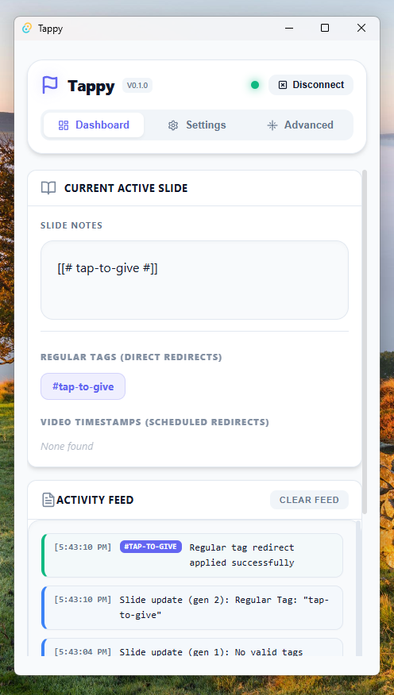

# Tappy

An open source link shortener integrated with ProPresenter, powered by Cloudflare Workers.



# What is Tappy?

Tappy is a link shortener that allows you to create short, custom URLs for your domains. The main difference between it
and services like Bitly or TinyURL is that Tappy is designed specifically for use with ProPresenter, a popular
presentation software used in churches and other events. With Tappy, your ProPresenter slides can change the
link that your shortened URL points to, making your slides more dynamic and interactive.

Tappy is a Tauri app, not an Electron app, meaning that it is extremely lightweight. The Tappy executable is only ~17MB
in size and only uses 6.2MB of RAM when in use (On Windows).

To get started, download Tappy and follow the setup guide.

## Inspiration

Tappy got its inspiration
from [Overflow Tap](https://www.overflow.co/learn/the-only-tap-that-integrates-with-propresenter), which also has a
ProPresenter integration for its link shorteners. Overflow Tap has many more features besides link shorteners, but
Tappy's only purpose is to be a shortener.

Unlike Overflow Tap, Tappy is open-source, free, and self-hosted. Links are configured solely from the Desktop
application, whereas Overflow Tap requires configuring within their dashboard and charges a [$2,500/year subscription
fee](https://www.overflow.co/genu/pricing#:~:text=Here%20is%20a%20breakdown%20of%20our%20annual%20subscription%20packages).

Finally, Tappy supports custom domains and redirects timed with video (for example, using the same link throughout an
announcement video, but changing the link at a specific time in the video per announcement).

# Cost

As Tappy uses Cloudflare Workers, there are several limits. Cloudflare Workers is essentially Cloud Infrastructure, and
the Cloud is notoriously challenging to price. So, I've broken down the cost of Tappy below.

Tappy is completely free, but it requires a Cloudflare account. These are free, thankfully. Tappy also uses Cloudflare
Workers and Cloudflare Workers KV, which are both free. However, Workers has a 100k requests/day limit and 10ms/request
limit, and Workers KV has a limit of 1 GB of data storage **total**, 1000 writes, deletes, and lists/day, and 100k
reads/day.

Each time Tappy updates a redirect, it uses one request and one write to Workers and Workers KV, respectively. Each time
a user makes a request to a redirect, it uses one request to Workers and one read from Workers KV, as well. If your
organization does not plan on exceeding these limits, then Tappy is essentially 100% free. However, if these limits are
exceeded and you are not on a paid plan, Tappy will cease to work.

To increase these limits, the Paid tier of Workers is $0.30/million requests, and $0.02/million CPU ms. The paid tier of
Workers KV is $0.50/GB-month, $0.50/million read requests, and $5.00/million requests for write, delete, and list.

Larger organizations are almost guaranteed to exceed these limits. Thankfully, the limits over the span of a year would
likely be less than $5 compared to the $2,500/year as Overflow Tap costs.

# How it works

> [!IMPORTANT]
> Tappy only works with Cloudflare, so if you are not using Cloudflare for your domain, then this app is not for you.
> Tappy works by deploying a [Cloudflare Worker](https://www.cloudflare.com/products/workers/) to your domain, and
> utilizes [Cloudflare Workers KV](https://developers.cloudflare.com/kv/) to store these redirects.

When you first launch Tappy, you will be prompted to create a Cloudflare User API Token. Once you have your User API
Token, you provide it to Tappy which will then pull your available Zones and prompt you to create a link for your
worker.

Once your link is created, Tappy will automatically deploy the Cloudflare Worker and configure it to point to the
created link. After that, you'll be asked to set your redirect link path, as well as a fallback path if someone goes to
a link that doesn't exist. Once this is done, the app will open.

The Cloudflare User API Token can be deleted once used, as it is never used or needed again after initial setup. Tappy
generates a random admin token which acts as the "password" to the Worker. As the worker can only modify the KV store,
this token is considered "safe". If you ever need to reset this token, however, you can do so by clicking the Advanced
tab and selecting "Redo Onboarding Setup". You will need another Cloudflare User API Token to do this.

# Setting up links with Tappy

Click the "Settings" tab in Tappy to configure your links. Each link has a tag and a redirect URL. Once you add your
links, click the "Push Tag Mappings to Cloudflare Workers" button.

# Setting up ProPresenter

Go to the "Settings" tab in Tappy. Under the "PROPRESENTER CONNECTION" panel, enter your host's IP and port (Obtained
from ProPresenter → Settings → Network). In ProPresenter, go to the "Settings" tab and click the "Network" tab. Be
sure Network connections are enabled. In Tappy, click "Connect"!

## Static Redirects

On any slide, right-click it and select "Edit Slide". Open the slide notes (bottom of the right-side panel) and,
anywhere within the note, add your tag in the following format:

```text
[[# your-tag-here #]]
```

When the slide is triggered, Tappy will see this tag in the slide notes and set the current redirect to the URL that
this tag points to.

## Dynamic Redirects (Media)

On slides with media, you may add tags that are mapped to timestamps in the video. An example use-case for this would be
houses of worship. A single QR code may be placed on the back of each seat, pointing to the redirect URL. When an
announcement video or some other video is playing, Tappy may automatically set the redirect to the URL that this QR code
points to, allowing the codes to change as the video is played, all without having to change the tags or codes.

On any slide with media, right-click it and select "Edit Slide". Open the slide notes (bottom of the right-side panel)
and, anywhere within the note, add your tags in the following format:

```text
[[# mm:ss your-tag-here #]]
[[# mm:ss your-other-tag-here #]]
```

Media slides may support a single static tag (`[[# your-tag-here #]]`) as well as any number of dynamic tags. Tags are
automatically applied static first, then dynamic in order of timestamp. This means a list of tags such as this:

```text
[[# 1:00 last-tag #]]
[[# 0:30 first-tag #]]
[[# static-tag #]]
```

Will be applied `static-tag` first, then `first-tag` at the 30-second mark, then `last-tag` at the 1-minute mark.

For videos over 59 minutes and 59 seconds long, you must still use mm:ss format. For example, a video that is 1 hour and
10 minutes long would be `[[# 70:00 some-tag #]]`.
